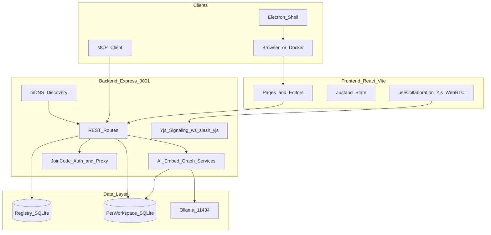

# RyFlow — System Architecture

> This document is the contributor-oriented reference for RyFlow's design. For setup and usage, see [README.md](README.md).

---


---

## Design Principles

- **Offline-first.** Every core capability works without internet. SQLite is the single source of truth; Ollama is the only AI dependency and runs locally.
- **No mandatory cloud.** LAN collaboration is optional. Remote access is peer-to-peer over LAN, not relayed through any hosted service.
- **Monorepo, multiple deployment targets.** The same `backend/` and `frontend/` serve both the Electron desktop app and the Docker-compose stack.
- **Extensible by design.** The backend follows a routes → services → data pattern. New features slot in without touching unrelated code.

---

## High-Level System Flow



---

## Repository Layout

```
RyFlow/
├── frontend/               # React 18 + Vite SPA
│   └── src/
│       ├── pages/          # Feature surfaces (Home, Documents, Tasks, Code, Canvas, Graph, AI Studio, Settings, WorkspaceManager)
│       ├── components/     # Editors, AI panels, layout, graph, workspace UI
│       ├── hooks/          # useCollaboration, useOllama, useVoice, useGraph …
│       └── store/          # Zustand global state
├── backend/                # Express API server
│   ├── index.js            # Entry point — HTTP, Socket.io, Y.js signaling, route mounting
│   ├── routes/             # 14 REST route modules (see Backend Routes below)
│   ├── services/           # Ollama, embeddings, HNSW, graph, Whisper, image
│   ├── db/
│   │   ├── schema.sql      # Per-workspace table definitions
│   │   ├── database.js     # Active workspace DB handle + workspace switching
│   │   └── registry.js     # Global workspace registry DB
│   ├── p2p/
│   │   └── discovery.js    # Bonjour/mDNS peer advertisement and browsing
│   ├── middleware/
│   │   ├── joinCodeAuth.js # Join-code validation for remote workspaces
│   │   └── remoteProxy.js  # HTTP proxy to host's backend for joined workspaces
│   ├── mcp/
│   │   └── server.js       # MCP stdio server (workspace search tools)
│   └── tests/
│       └── integration.api.test.js
├── electron/
│   ├── main.js             # Process orchestration, Ollama auto-start, system tray
│   └── preload.js          # Context bridge
├── scripts/
│   └── start-ollama.js     # Ollama health check and model pull on dev start
├── docker-compose.yml
└── package.json            # Root scripts: dev, electron, mcp, dist:*
```

---

## Backend Architecture

### Entry Point — `backend/index.js`

The server creates a single `http.Server` shared by:

- **Express** — all REST routes, CORS, Helmet headers
- **Socket.io** — WebRTC signaling (offer/answer/ICE for P2P discovery UI)
- **`ws` WebSocketServer** — Y.js topic-based pub/sub signaling at `/yjs`

On startup it also calls `startDiscovery()` unconditionally to advertise the workspace over mDNS.

### Route Modules — `backend/routes/`

| Module | Responsibility |
|--------|----------------|
| `documents.js` | CRUD, version save/restore, daily notes |
| `comments.js` | Threaded comments anchored to document ranges |
| `tasks.js` | Kanban tasks, natural-language creation via Ollama |
| `code.js` | Code files — CRUD and AI assist (explain, debug, optimise) |
| `canvas.js` | Excalidraw canvas save/load + AI description |
| `graph.js` | Knowledge graph edges, neighbours, backlinks |
| `ai.js` | Chat completion (streaming + non-streaming), RAG retrieval, system status |
| `chats.js` | Persistent AI chat session storage |
| `workspace.js` | Active workspace info, briefing, import triggers, sustainability log |
| `workspaces.js` | Multi-workspace registry — create, list, switch, delete, export/import |
| `templates.js` | Built-in and custom workspace templates |
| `tags.js` | Tag CRUD and cross-workspace tag filtering |
| `voice.js` | Whisper.cpp transcription endpoint |
| `folderImport.js` | Ingest local folders (`.md` + code) or clone a Git repo |

### Services Layer — `backend/services/`

| Service | Role |
|---------|------|
| `ollamaService.js` | HTTP client for Ollama: completion, streaming, embedding, model list |
| `embeddingService.js` | `embed()` dispatcher, cosine similarity, Float32 BLOB encode/decode |
| `hnswService.js` | HNSW approximate nearest-neighbour index (via `hnswsqlite`) |
| `graphService.js` | Build/update edges from embeddings and @mentions, compute neighbours |
| `whisperService.js` | Shell out to Whisper.cpp binary, return transcript |
| `imageService.js` | Pollinations.ai image generation (network-dependent) |

### Middleware

- **`joinCodeAuth.js`** — validates `x-join-code` header; gates all write routes for remote workspace sessions.
- **`remoteProxy.js`** — proxies requests to the host machine's backend when the client has joined a remote workspace, so the guest frontend never talks to a different backend origin.

---

## Data Model

RyFlow uses two SQLite databases managed by `better-sqlite3`.

### Registry DB (`registry.js`)

Tracks all known workspaces and the currently active session:

```
workspaces_registry  (id, name, path, created_at)
active_session       (id=1, workspace_id)
```

### Per-Workspace DB (`schema.sql`)

Each workspace gets its own isolated SQLite file. Key tables:

| Table | Purpose |
|-------|---------|
| `workspaces` | Workspace metadata, join code, host IP/port |
| `users` | Team members with avatar colour and language |
| `documents` | Rich-text content, version counter, daily-note flag |
| `document_versions` | Full content snapshots for version history |
| `comments` | Threaded comments with anchor ranges and resolved state |
| `tasks` | Kanban cards with status, priority, assignee |
| `code_files` | Code content with language tag |
| `canvas_items` | Excalidraw JSON payloads |
| `embeddings` | Float32 BLOBs (768-dim), one row per content item |
| `tags` | Tag definitions; `item_tags` join for polymorphic tagging |
| `ai_chats` / `ai_messages` | Persistent RAG chat history |
| `templates` | Built-in and user-defined document templates |

The `hnswsqlite` service maintains an in-memory HNSW index rebuilt from the `embeddings` table on startup.

---

## AI Pipeline

```
User content written
        │
        ▼
  nomic-embed-text (Ollama)
  → 768-dim vector → stored in embeddings table + HNSW index
        │
        ▼
  On query (search / RAG chat):
    1. HNSW ANN top-K semantic candidates
    2. FTS5 BM25 keyword candidates
    3. Reciprocal Rank Fusion (RRF) merge
    4. Recency score applied
    5. Top results injected as context into phi3:mini prompt
        │
        ▼
  Streamed response via POST /api/ai/chat/stream
```

**Default models:** `phi3:mini` (generation), `nomic-embed-text` (embeddings). Any Ollama-compatible model can be substituted.

**ROCm path:** `GET /api/ai/system-status` detects AMD GPU availability and reports it to the frontend. Ollama uses ROCm automatically when installed; no code change needed.

**Voice:** Whisper.cpp binary is invoked as a child process. Binary path and model path are set via environment variables (see `.env.example`). Ryzen AI NPU acceleration is supported when the SDK is present.

**Image generation:** Pollinations.ai API (cloud). This is the only feature that requires internet access.

---

## Collaboration Subsystem

### LAN Discovery

`backend/p2p/discovery.js` uses `bonjour-service` to advertise the workspace on the local network. The frontend polls `GET /api/peers` every 5 seconds; results are written to Zustand and rendered in the peer list.

### Real-Time Document Co-Editing

Y.js CRDTs power conflict-free merging for the TipTap rich-text editor:

- The frontend creates a `Y.Doc` and a `WebrtcProvider` (from `y-webrtc`) connecting to `ws://host:3001/yjs`.
- `backend/index.js` implements the full y-webrtc topic pub/sub protocol over a `ws.WebSocketServer` — no external relay.
- Awareness (cursor position, user name, avatar colour) is wired via `CollaborationCursor` in `RichEditor.jsx`.

**Scope:** CRDT sync is active for the **TipTap document editor only**, and only when the workspace is in remote (joined) mode. Tasks, canvas, and code files do not currently use Y.js.

### Remote Workspace Join

1. Host generates a join code stored in the `workspaces` table.
2. Guest enters the host's IP and join code in Workspace Manager.
3. Guest frontend stores the remote host details in `localStorage`.
4. All API requests from the guest are intercepted by `remoteProxy.js` and forwarded to the host's backend with the `x-join-code` header.
5. `joinCodeAuth.js` on the host validates the code before processing.

### Known Limitations

- No TURN server is configured. `y-webrtc` uses browser-default STUN (Google). Connections fail across strict NAT or WiFi with client isolation.
- Tasks and canvas changes are not CRDT-synced between peers in real time.

---

## Deployment Modes

| Mode | Command | Notes |
|------|---------|-------|
| **Docker** | `docker compose up` | Ollama + backend + nginx frontend; model pull on first run |
| **Dev** | `npm run dev` | Concurrently runs Ollama check, Express, and Vite dev server |
| **Electron** | `npm run electron` | Electron spawns backend and serves built frontend; system tray |
| **Packaged** | `npm run dist:win/mac/linux` | electron-builder produces NSIS/DMG/AppImage |

Docker services and health-check order: `ollama` → `ollama-setup` (model pull) → `backend` → `frontend` (nginx on 5173).

---

## MCP Server

RyFlow ships a [Model Context Protocol](https://modelcontextprotocol.io) server that exposes the active workspace to any MCP-compatible client (Claude Desktop, Cursor, etc.).

```bash
npm run mcp
```

The server uses stdio transport and reads the same SQLite handle as the running app (no extra connections). It resolves the target workspace from `RYFLOW_MCP_WORKSPACE_ID` env var or the `active_session` registry row.

| Tool | Description |
|------|-------------|
| `search_workspace` | Semantic + keyword search across all workspace content |
| `get_document` | Retrieve a document by ID or title |
| `get_neighbours` | Return knowledge-graph neighbours for an item |
| `list_workspace_contents` | Enumerate documents, tasks, code files, and canvases |

---

## Extending RyFlow

### Adding a new feature

The typical pattern:

1. **Backend:** add a route file in `backend/routes/`, register it in `backend/index.js`, add a service in `backend/services/` if needed.
2. **Data:** extend `backend/db/schema.sql` (migrations run on workspace open via `CREATE TABLE IF NOT EXISTS`).
3. **Frontend:** add a page in `frontend/src/pages/` and wire it in the React Router config; consume the API via Axios.
4. **MCP (optional):** add a tool to `backend/mcp/server.js` so AI clients can access the new data.

### Good first contributions

- Extend CRDT sync to tasks or canvas items
- Add a TURN/STUN configuration option for WebRTC over the internet
- Expand MCP tool coverage
- Increase test coverage in `backend/tests/` or `frontend/src/`
- Add or improve i18n strings (English, Hindi, Spanish, Marathi currently supported)
- New built-in templates

---

## References

- [README.md](README.md) — setup, quick start, full feature list
- [COLLABORATION_AUDIT.md](COLLABORATION_AUDIT.md) — detailed audit of the Y.js and WebRTC layer
- [backend/db/schema.sql](backend/db/schema.sql) — full database schema
- [backend/index.js](backend/index.js) — server entry point
- [backend/mcp/server.js](backend/mcp/server.js) — MCP tool implementations
