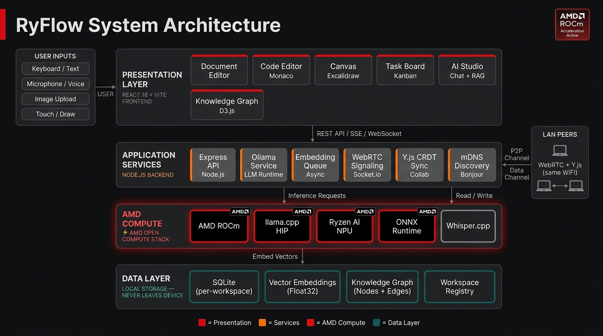

<div align="center">


<br />

# RyFlow

**Your workspace. Your GPU. Your AI.**

An offline-first, AMD-accelerated AI collaboration workspace for teams and contributors who want private, local AI. Mo cloud, no subscriptions, no data leaving your machine.

[](https://rocm.docs.amd.com)
[](https://ollama.ai)
[](https://www.electronjs.org)
[](LICENSE)
[](package.json)

</div>

---

## What is RyFlow?

RyFlow turns the AMD chip already in your machine into a private, offline AI brain that your entire team shares. Every feature — writing assistance, semantic search, real-time collaboration, voice transcription — runs locally using AMD's open-source ROCm stack and free, quantized language models.

**The result:** A zero-cost AI workspace that works on air-gapped networks, remembers everything your team has ever created, and gets faster when it detects an AMD GPU.

### Who it's for

- Engineering, product, and research teams on LAN or air-gapped networks
- Professionals who need local LLMs without cloud lock-in or usage fees
- Open source contributors extending a self-hosted AI workspace
- Anyone who wants a fully private Notion-style workspace with built-in AI

---

## Architecture



> See [ARCHITECTURE.md](ARCHITECTURE.md) for the full system design, data model, and contributor guide.

---

## Features

| Feature | Description |
|---|---|
| **Local AI** | Phi-3 Mini / Gemma 2B via Ollama — runs entirely on-device, no API keys |
| **AMD ROCm** | Auto-detects AMD GPU and switches to hardware-accelerated inference (up to 10× faster) |
| **P2P Collaboration** | Real-time co-editing of documents over LAN via WebRTC + Y.js CRDTs, self-hosted signaling |
| **Remote Join Codes** | Connect to a host's workspace from another machine over LAN using a generated join code |
| **Hybrid Search** | Semantic vector search (HNSW ANN) fused with BM25 keyword search (FTS5) and recency scoring |
| **Knowledge Graph** | Auto-built graph of backlinks, @mentions, and embedding-derived edges; D3 visualisation |
| **Multi-Workspace** | Create, switch, and manage multiple isolated workspaces from a single session |
| **Document Editor** | TipTap rich-text editor with AI writing assistance, comments, version history, and backlinks |
| **Code Editor** | Monaco editor with AI explain, debug, and optimise |
| **Canvas** | Excalidraw-powered freeform drawing with AI description |
| **Task Board** | Natural-language task creation — type a sentence, get a Kanban card |
| **AI Studio** | Persistent RAG chat — answers are grounded in your workspace content |
| **Knowledge Guide** | Auto-generate summaries, key terms, and quizzes from any document set |
| **AI Morning Briefing** | Daily LLM-generated standup digest read aloud via browser TTS |
| **Command Palette** | `Ctrl/Cmd+K` workspace-wide semantic search and navigation |
| **Templates** | Built-in and custom workspace templates (Meeting Notes, Project Brief, Sprint Retro, and more) |
| **Folder & Git Import** | Ingest local `.md` + code files or clone a Git repo directly into a workspace |
| **Voice Input** | Offline transcription via Whisper.cpp (Ryzen AI NPU accelerated when available) |
| **MCP Server** | Expose workspace search and content to any MCP-compatible AI client via `npm run mcp` |
| **Tags** | Tag any item across the workspace for filtered views |
| **Daily Notes** | Auto-created daily scratchpad |
| **Workspace Export** | Export entire workspace as a `.ryflow` bundle; import on any device |
| **LAN Discovery** | Auto-discover peers on the same network via mDNS |
| **Image Generation** | AI image generation via Pollinations.ai *(requires internet — the only non-local AI feature)* |

---

## Tech Stack

| Category | Technologies |
|---|---|
| **Frontend** | React 18 + Vite, TailwindCSS, TipTap, D3.js, Monaco Editor, Excalidraw, Framer Motion, Zustand |
| **Backend** | Node.js + Express, Socket.io, better-sqlite3 (SQLite) |
| **AI Layer** | Ollama (Phi-3 Mini, nomic-embed-text), Whisper.cpp, Pollinations.ai |
| **AMD Stack** | ROCm (GPU inference), llama.cpp HIP, Ryzen AI SDK + ONNX Runtime (NPU) |
| **Networking** | WebRTC (simple-peer), Y.js CRDTs, Bonjour/mDNS |
| **Desktop** | Electron |
| **Container** | Docker + Docker Compose |

---

## Quick Start

### Option 1 — Docker (Recommended)

The easiest way to run RyFlow. Downloads Ollama and the required AI models automatically.

**Prerequisites:** [Docker Desktop](https://www.docker.com/products/docker-desktop/)

```bash
git clone https://github.com/sh4shv4t/RyFlow.git
cd RyFlow
docker compose up
```

Then open: http://localhost:5173

First run downloads `phi3:mini` (~2.4 GB) and `nomic-embed-text` (~270 MB). This is a one-time setup; subsequent starts are instant.

### Option 2 — Native Dev Server

Prerequisites:
- Node.js 18+
- [Ollama](https://ollama.ai) installed

```bash
git clone https://github.com/sh4shv4t/RyFlow.git
cd RyFlow

# Install all dependencies
npm run install:all

# Start backend, frontend, and Ollama health check together
npm run dev
```

`npm run dev` auto-checks Ollama, starts it if possible, and pulls required models on first run.

If Ollama cannot be auto-started, run it manually first:

```bash
ollama serve
ollama pull phi3:mini
ollama pull nomic-embed-text
```

### Option 3 — Electron Desktop App

```bash
# After completing the Option 2 setup:
npm run electron
```

### AMD ROCm Acceleration (Optional)

If you have an AMD GPU, install ROCm for up to 10× faster AI inference:

- **Linux:** [ROCm Installation Guide](https://rocm.docs.amd.com/en/latest/deploy/linux/quick_start.html)
- **Windows:** ROCm support via WSL2

Ollama detects and uses ROCm automatically. RyFlow shows `⚡ AMD` in the top bar when active.

### Voice Input (Optional)

```bash
git clone https://github.com/ggerganov/whisper.cpp
cd whisper.cpp
make
bash ./models/download-ggml-model.sh base
```

Set the binary and model paths in your `.env` (see `.env.example`).

---

## Development

```bash
# Run backend and frontend together (with Ollama check)
npm run dev

# Backend only (port 3001)
npm run dev:backend

# Frontend only (port 5173)
npm run dev:frontend

# Frontend unit tests
npm --prefix frontend test -- --run

# Backend integration tests
npm --prefix backend run test:integration

# MCP server (requires an active workspace)
npm run mcp

# Build for production
npm --prefix frontend run build
```

---

## How It Works

### Local AI

RyFlow runs Phi-3 Mini via Ollama entirely on your device — no data leaves your machine. Every chat, summarisation, and task parse happens locally. When an AMD GPU with ROCm is detected, inference is automatically offloaded to the GPU.

### Knowledge Graph & Search

Every document, task, code file, canvas, and chat is converted into a 768-dimension vector embedding using `nomic-embed-text` and stored in SQLite. Retrieval uses a **hybrid pipeline**: approximate nearest-neighbour search (HNSW) is fused with BM25 full-text search (FTS5) via Reciprocal Rank Fusion, then re-ranked by recency. The result is semantic + keyword search across your entire workspace history.

### P2P Collaboration

Peers on the same LAN are discovered automatically via mDNS. Document co-editing uses WebRTC data channels and Y.js CRDTs with a self-hosted signaling server at `ws://host:3001/yjs` — no external relay. Remote workspaces on different machines connect via join codes, with the host acting as a reverse proxy. Note: real-time CRDT sync currently covers the TipTap document editor only; tasks and canvas do not yet sync live.

### Workspace Portability

Export your entire workspace as a `.ryflow` file (a zip of the SQLite database and uploads). Import it on any device to continue where you left off. Workspace knowledge persists across devices, migrations, and team handoffs.

### MCP Integration

Run `npm run mcp` to expose your active workspace to any [Model Context Protocol](https://modelcontextprotocol.io)-compatible client (Claude Desktop, Cursor, etc.). Available tools: `search_workspace`, `get_document`, `get_neighbours`, `list_workspace_contents`.

---

## Contributing

Contributions of all sizes are welcome. For anything beyond a small fix, please open an issue first so we can align on approach.

### Repo layout

```
frontend/   # React + Vite SPA — pages, editors, Zustand store, Vitest tests
backend/    # Express API, SQLite, Ollama/Whisper services, P2P discovery, MCP server
electron/   # Desktop shell — spawns backend/frontend, system tray, electron-builder
scripts/    # Ollama bootstrap and model-pull helpers
```

See [ARCHITECTURE.md](ARCHITECTURE.md) for a full system map, data model, and notes on each subsystem. [COLLABORATION_AUDIT.md](COLLABORATION_AUDIT.md) covers the Y.js and WebRTC layer in depth.

### Workflow

```bash
# Fork, then clone your fork
git clone https://github.com/your-username/RyFlow.git
cd RyFlow
npm run install:all

git checkout -b feat/your-feature-name

# Make changes, then run tests
npm --prefix frontend test -- --run
npm --prefix backend run test:integration

git commit -m "feat: describe your change"
git push origin feat/your-feature-name
# Open a Pull Request
```

Follow conventional commit prefixes: `feat:`, `fix:`, `docs:`, `refactor:`, `test:`.

---

## License

MIT — see [LICENSE](LICENSE) for details.

---

<div align="center">
Built on AMD ROCm and open-source tooling.<br/>
RyFlow — Don't rent intelligence. Run it.
</div>
